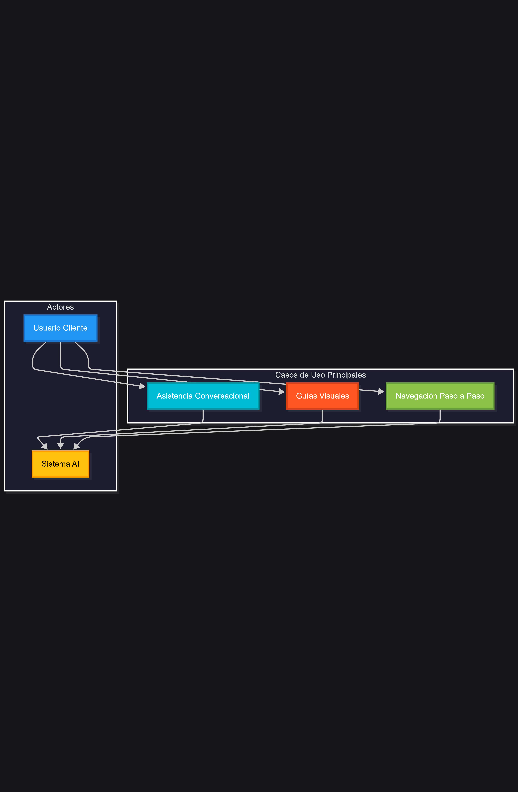
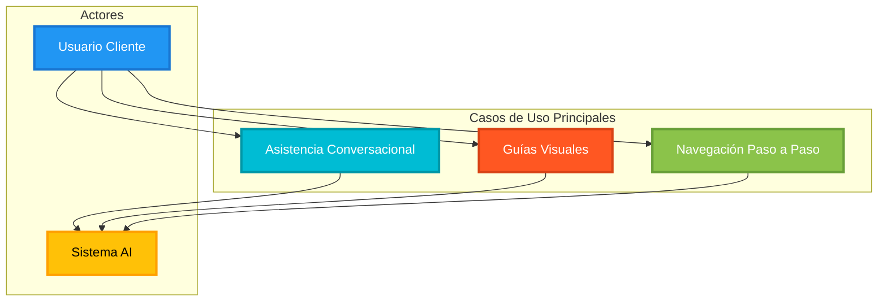
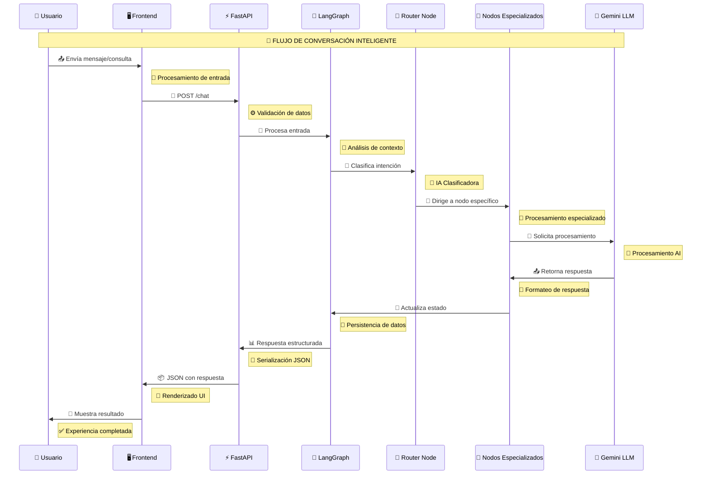
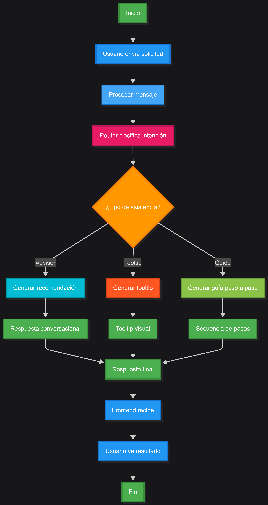
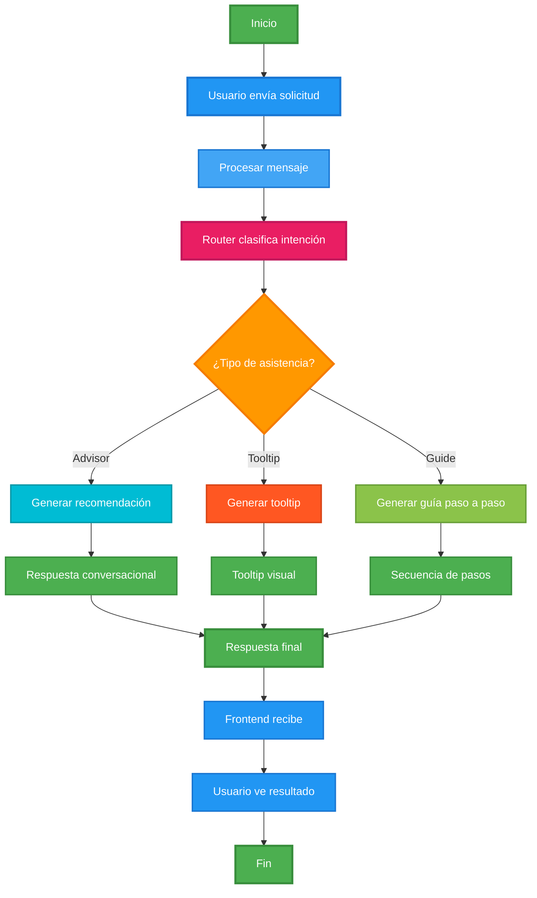
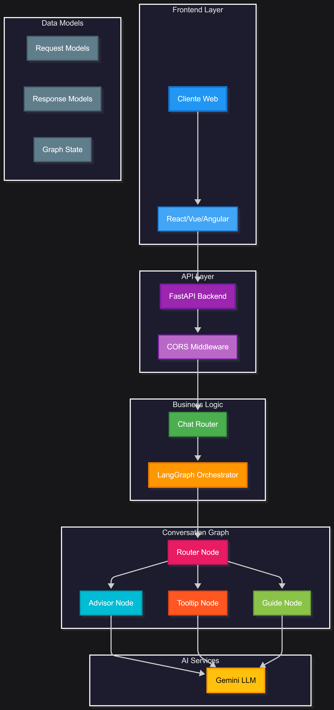
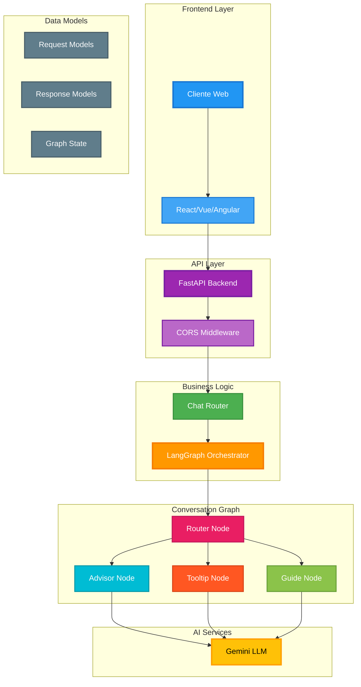

<div align="center">
  
</div>

# Ecommerce Copilot Backend - API 🤖

## Índice
1. [Descripción](#descripción)
2. [Arquitectura del Sistema](#arquitectura-del-sistema)
3. [Ambiente de Implementación](#ambiente-de-implementación)
4. [Principales Librerías Utilizadas](#principales-librerías-utilizadas)
5. [Guía de Inicio Rápido](#guía-de-inicio-rápido)
6. [Arquitectura del Sistema](#arquitectura-del-sistema)
    1. [Diagramas](#diagramas)
    2. [Actores del Sistema](#actores-del-sistema)
    3. [Casos de Uso](#casos-de-uso)
    4. [Diagrama Secuencial](#diagrama-secuencial)
    5. [Diagrama de Flujo](#diagrama-de-flujo)
    6. [Diagrama de Arquitectura](#Diagrama-Arquitectura)
7. [API Endpoints](#api-endpoints)
8. [Estructura de Carpetas y Archivos](#estructura-de-carpetas-y-archivos)
9. [FAQ's y Problemas Comunes](#faqs-y-problemas-comunes)

## Descripción

**Ecommerce Copilot Backend** es una API inteligente basada en FastAPI que proporciona asistencia conversacional y visual para plataformas de comercio electrónico. El sistema utiliza un grafo de conversación con múltiples nodos especializados para ofrecer diferentes tipos de asistencia:

- **Asesoramiento**: Recomendaciones de productos y asistencia general
- **Tooltips Interactivos**: Guías visuales para elementos de la interfaz
- **Guías Paso a Paso**: Secuencias completas de navegación

El sistema integra Google Gemini AI para el procesamiento de lenguaje natural, proporcionando una experiencia de usuario enriquecida y contextual.

### Características Principales

- 🤖 **Asistente Conversacional Inteligente**: Procesamiento de lenguaje natural con clasificación automática de intenciones
- 🎯 **Tooltips Interactivos**: Guías visuales contextuales para elementos de la interfaz
- 📋 **Guías Paso a Paso**: Secuencias completas de navegación para tareas complejas
- 🖼️ **Análisis de Imágenes**: Capacidad de procesar y analizar imágenes con Gemini Vision
- 🔄 **Grafo de Conversación**: Arquitectura modular con nodos especializados
- ⚡ **API REST**: Endpoints optimizados para integración con frontend

## Arquitectura del Sistema

El sistema está construido sobre una arquitectura de grafo de conversación que utiliza LangGraph para orquestar diferentes tipos de asistencia:

```
┌─────────────────┐    ┌─────────────────┐    ┌─────────────────┐
│   Frontend      │    │   FastAPI       │    │   Gemini AI     │
│   (Cliente)     │◄──►│   Backend       │◄──►│   (LLM)         │
└─────────────────┘    └─────────────────┘    └─────────────────┘
                              │
                              ▼
                       ┌─────────────────┐
                       │   LangGraph     │
                       │   (Orquestador) │
                       └─────────────────┘
                              │
                    ┌─────────┼─────────┐
                    ▼         ▼         ▼
            ┌─────────────┐ ┌─────────────┐ ┌─────────────┐
            │ Router Node │ │ Advisor     │ │ Tooltip     │
            │             │ │ Node        │ │ Node        │
            └─────────────┘ └─────────────┘ └─────────────┘
                    │               │               │
                    ▼               ▼               ▼
            ┌─────────────┐ ┌─────────────┐ ┌─────────────┐
            │ Guide Node  │ │ Respuesta   │ │ Tooltip     │
            │             │ │ Conversacional│ │ Visual    │
            └─────────────┘ └─────────────┘ └─────────────┘
```

## Ambiente de Implementación

| Entorno | Ubicación | Descripción |
|---------|-----------|-------------|
| Desarrollo | Local | Entorno de desarrollo local https://github.com/Nicolas-Pena-Mogollon/ecommerce-copilot-backend |
| Producción | Render | Despliegue automático en Render.com |

### Requisitos del Sistema

- **Python**: 3.8+
- **Memoria RAM**: Mínimo 512MB
- **Almacenamiento**: 1GB disponible
- **Red**: Conexión a internet para APIs de Gemini

## Principales Librerías Utilizadas

| Librería | Versión | Propósito |
|----------|---------|-----------|
| **fastapi** | 0.116.1 | Framework web para APIs REST |
| **uvicorn** | 0.35.0 | Servidor ASGI para FastAPI |
| **langchain** | 0.3.27 | Framework para aplicaciones LLM |
| **langgraph** | 0.6.2 | Orquestación de grafos de conversación |
| **google-generativeai** | 0.8.5 | Integración con Gemini AI |
| **pydantic** | 2.11.7 | Validación de datos y modelos |
| **python-dotenv** | 1.1.1 | Gestión de variables de entorno |

## Guía de Inicio Rápido

### Requisitos Previos

1. **Python 3.8+** instalado
2. **Git** para clonar el repositorio
3. **API Key de Gemini** configurada

### Instalación

```bash
# 1. Clonar el repositorio
git clone https://github.com/Nicolas-Pena-Mogollon/ecommerce-copilot-backend
cd ecommerce-copilot-backend

# 2. Crear entorno virtual
python -m venv venv
source venv/bin/activate  # En Windows: venv\Scripts\activate

# 3. Instalar dependencias
pip install -r requirements.txt

# 4. Configurar variables de entorno
cp .env.example .env
# Editar .env con tu API key de Gemini
```

### Configuración

Crear archivo `.env` con las siguientes variables:

```env
GEMINI_API_KEY=tu_api_key_aqui
GEMINI_MODEL=gemini-2.0-flash
```

### Ejecución

```bash
# Desarrollo (con hot-reload)
uvicorn main:app --reload --host 0.0.0.0 --port 8000

# Producción
uvicorn main:app --host 0.0.0.0 --port 10000
```

### Verificación

1. **API Docs**: http://localhost:8000/docs
2. **Health Check**: http://localhost:8000/health

## Diagramas


### Casos de Uso





### Diagrama Secuencial




### Diagrama de Flujo




### Diagrama Arquitectura






## API Endpoints

### Chat Endpoint

#### POST `/chat`
Procesa mensajes del usuario y retorna asistencia contextual.

**Cuerpo de la solicitud:**
```json
{
  "userInput": "¿Cuál me recomiendas?",
  "uiContext": {
    "view": "product_list",
    "visibleProducts": [...],
    "cartItems": [...],
    "searchTerm": "laptop"
  }
}
```

**Respuesta exitosa (200):**
```json
{
  "response": "Basándome en los productos que veo, te recomiendo la Laptop Pro X1 por su excelente relación calidad-precio y las buenas reseñas que tiene."
}
```

**Respuesta con tooltip (200):**
```json
{
  "response": "Te muestro dónde está el botón de agregar al carrito",
  "popup": {
    "type": "info",
    "target": "product_button",
    "title": "Agregar al Carrito",
    "message": "Haz clic aquí para agregar el producto",
    "targetInfo": {
      "ID": 1
    }
  }
}
```


## Estructura de Carpetas y Archivos

```
ecommerce-copilot-backend/
├── app/
│   ├── config/
│   │   └── config.py              # Configuración del sistema
│   ├── graph/
│   │   ├── graph_state.py         # Estado del grafo de conversación
│   │   ├── llm.py                 # Configuración del LLM
│   │   ├── main_graph.py          # Grafo principal de conversación
│   │   └── nodes/
│   │       ├── advisor_node.py    # Nodo de asesoramiento
│   │       ├── guide_node.py      # Nodo de guías paso a paso
│   │       ├── router_node.py     # Nodo clasificador
│   │       └── tooltip_node.py    # Nodo de tooltips
│   ├── models/
│   │   ├── guide_output.py        # Modelo de salida para guías
│   │   ├── request_model.py       # Modelo de solicitud
│   │   ├── router_output.py       # Modelo de salida del router
│   │   ├── tooltip_output.py      # Modelo de salida para tooltips
│   │   └── ui_context.py         # Modelo de contexto UI
│   ├── routes/
│   │   ├── chat.py               # Endpoint de chat
│   │   └── vision.py             # Endpoint de visión
│   └── services/
│       └── gemini_client.py      # Cliente de Gemini AI
├── docs/
│   └── README.pdf                # Documentación en PDF
├── image/
│   ├── diagrama-arquitectura-ecommerce-copilot-backend.png
│   ├── diagrama-caso.uso-copilot-backend.png
│   ├── diagrama-flujo-ecommerce-copilot-backend.png
│   ├── diagrama-secuencia-copilot-backend.png
│   └── flow.png                  # Diagrama del grafo generado
├── logger.py                     # Configuración de logging
├── main.py                       # Aplicación principal FastAPI
├── README.md                     # Documentación del proyecto
├── render.yaml                   # Configuración de despliegue
└── requirements.txt              # Dependencias del proyecto
```

## FAQ's y Problemas Comunes

### ¿Cómo configurar la API key de Gemini?

1. Ve a [Google AI Studio](https://makersuite.google.com/app/apikey)
2. Crea una nueva API key
3. Agrega la key al archivo `.env`:
   ```env
   GEMINI_API_KEY=tu_api_key_aqui
   ```

### ¿Cómo personalizar las respuestas del asistente?

- Modifica los mensajes del sistema en los archivos de nodos (`advisor_node.py`, `tooltip_node.py`, etc.)
- Ajusta la lógica de clasificación en `router_node.py`
- Personaliza los modelos de salida en la carpeta `models/`

### ¿Cómo agregar nuevos tipos de asistencia?

1. Crea un nuevo nodo en `app/graph/nodes/`
2. Agrega el nodo al grafo en `main_graph.py`
3. Actualiza la lógica de clasificación en `router_node.py`
4. Crea el modelo de salida correspondiente

### ¿Cómo desplegar en producción?

El proyecto está configurado para despliegue automático en Render.com:

1. Conecta tu repositorio a Render
2. Configura las variables de entorno en Render
3. El despliegue se realizará automáticamente


<div align="center">
  
  <br/>
  <strong>Desarrollado por el</strong> <code>Equipo de Desarrollo AIopsTI Syndicate</code>
</div>

